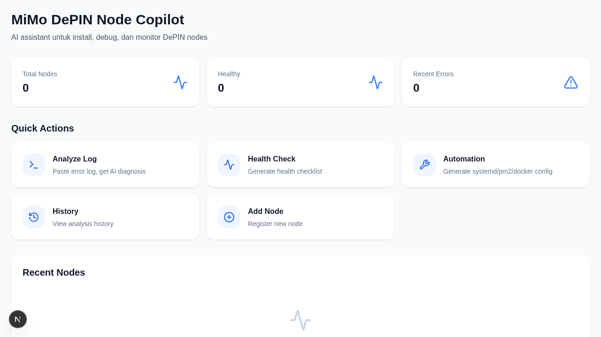
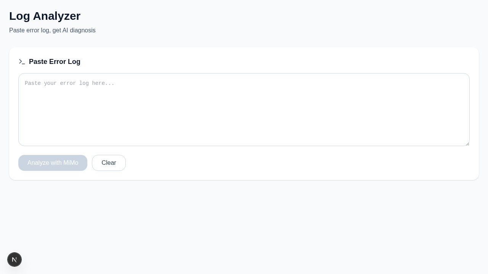
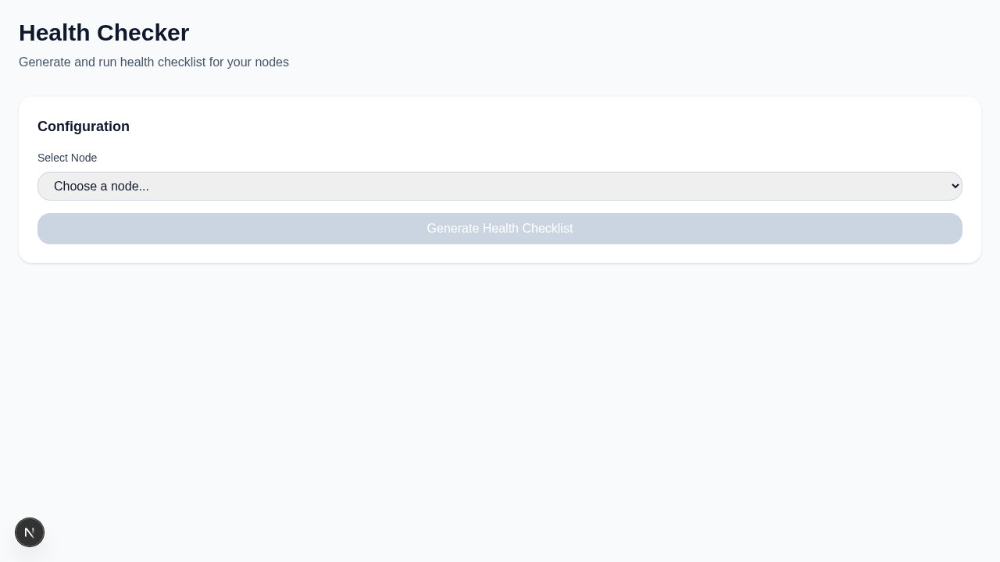
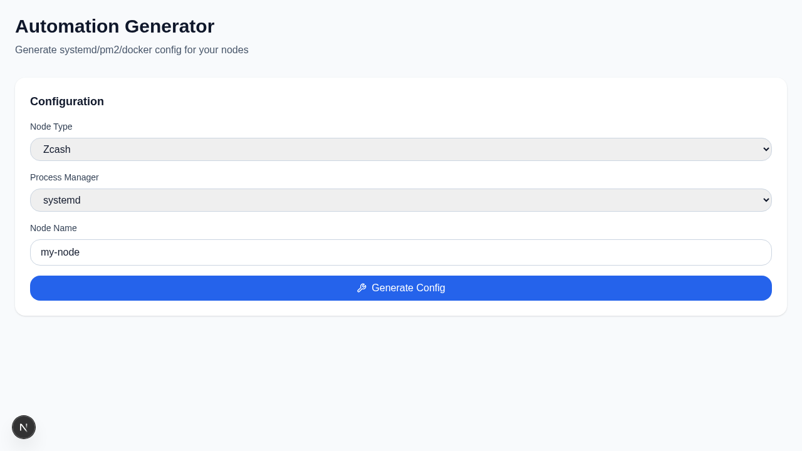
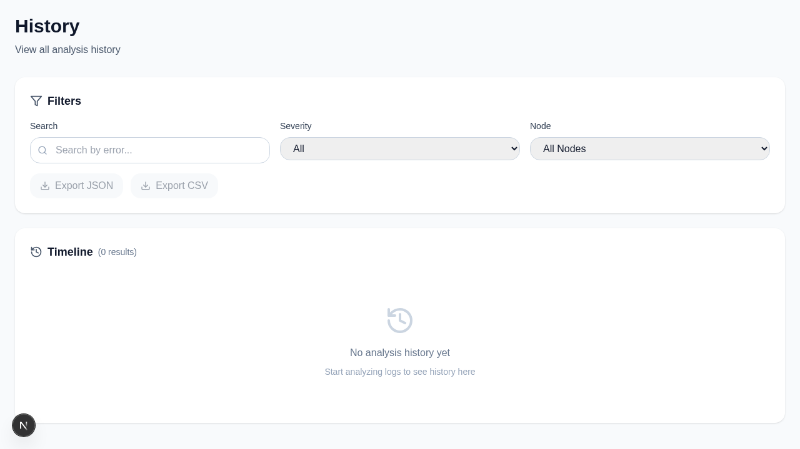
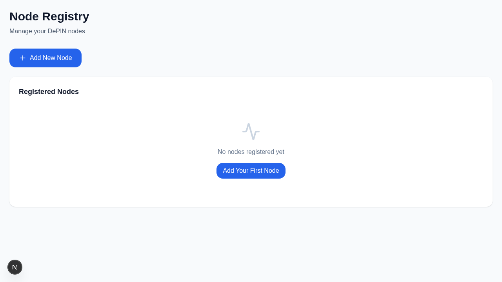

# Screenshots

## 🏠 Dashboard

- Quick stats: Total nodes, healthy nodes, recent errors
- Quick action cards for all features
- Empty state with CTA

## 🔍 Log Analyzer

- Paste error log
- AI diagnosis with root cause
- Severity level badge
- Copy-paste ready commands

## 🏥 Health Checker

- Generate health checklist
- Analyze node health
- Health score (0-100)
- Status indicators

## ⚙️ Automation Generator

- Select node type & process manager
- Generate config file
- Generate startup script
- Download buttons

## 📊 History

- Search by keyword
- Filter by severity & node
- Export to JSON/CSV
- Timeline view

## 🗂️ Node Registry

- Add/edit/delete nodes
- Node list with quick actions
- Persistent storage
